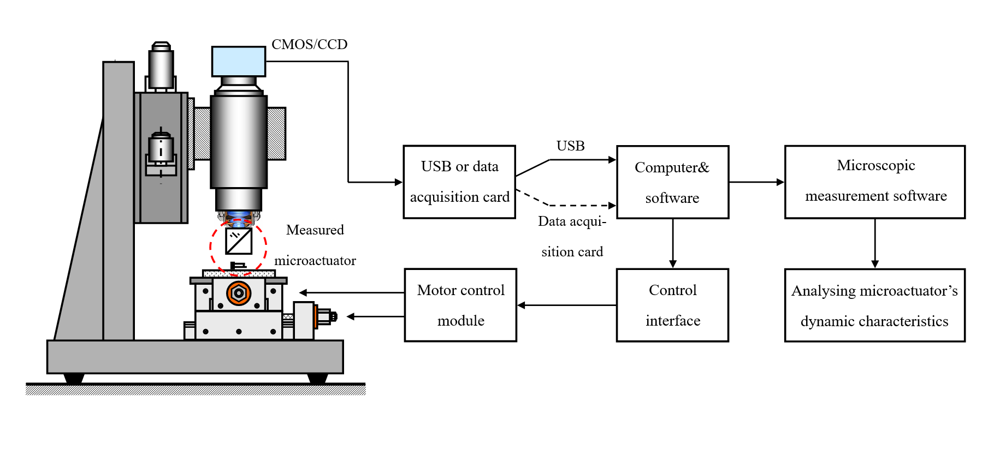

+++
# Date this page was created.

# Project title.
title = "high-speed microscopic measurement system"
font_size="12"

# Project summary to display on homepage.
summary = " "

weight = 2

# Tags: can be used for filtering projects.
# Example: `tags = ["machine-learning", "deep-learning"]`
tags = []
categories = []

# Optional external URL for project (replaces project detail page).
external_link = ""

# Slides (optional).
#   Associate this project with Markdown slides.
#   Simply enter your slide deck's filename without extension.
#   E.g. `slides = "example-slides"` references 
#   `content/slides/example-slides.md`.
#   Otherwise, set `slides = ""`.
slides = "" # //bit.ly/rlel-github-meetup

# Links (optional).
url_pdf = ""
url_slides = ""
url_video = ""
url_code = ""

# Custom links (optional).
#   Uncomment line below to enable. For multiple links, use the form `[{...}, {...}, {...}]`.
url_custom = []

# Does the project detail page use math formatting?
math = true

# Featured image
# To use, add an image named `featured.jpg/png` to your page's folder. 
[image]
  # Caption (optional)
  caption = ""

  # Focal point (optional)
  # Options: Smart, Center, TopLeft, Top, TopRight, Left, Right, BottomLeft, Bottom, BottomRight
  focal_point = "Smart"
  
  # Show image only in page previews?
  preview_only = true

+++
<h8 style="text-align: justify;">
   A system using high-speed microscopic observation and dynamic measurement technology has been established in this project (shown as Fig.1), microactuators’ motion states and dynamic characteristics can be tested based on this system. High-speed CMOS/CCD (240fps) combined with optical microscope is used in this system to capture the video of actuator’s movement and a sub-pixel motion analysis software is utilized to acquare the characteristics of microactuators such as deflection, amplitude, displacement and so on. This non-contact optical testing method has the advantages of non-destruction, non-contact, high-speed and high-precision.</h8>

<h8 style="text-align: justify;">
    As is known to all, pixel is the smallest unit in the imaging system. However, sub-pixel fitting is an efficient way to break this limit, thus a high-precision testing system whose minimum resolution is 0.1µm has been established. Procedure of the sub-pixel fitting based analysis software (time-axis) is shown as Fig.2. </h8>

 
    <figcaption>
<h10>Fig.2 Procedure of the time axis fitting software.</h10>
  
<figure>
 
  <figcaption>
      <h10>Fig.2 Procedure of the time axis fitting software.</h10>
  </figcaption>
</figure>

  

<h8 style="text-align: justify;">
This time-axis analysis software (shown as Fig.3) which is based on Visual Studio and Microsoft Foundation Classes (MFC) can acquire the relationship between time and feature point’s displacement, thus amplitude and frequency of microactuators can be further derived accurately. Similar to this time-axis analysis software, spatial-axis analysis software which shows the moving trail of the feature point can be constructed as well.</h8>

  
  <figcaption>
<h10>Interface of the time axis fitting software</h10>

