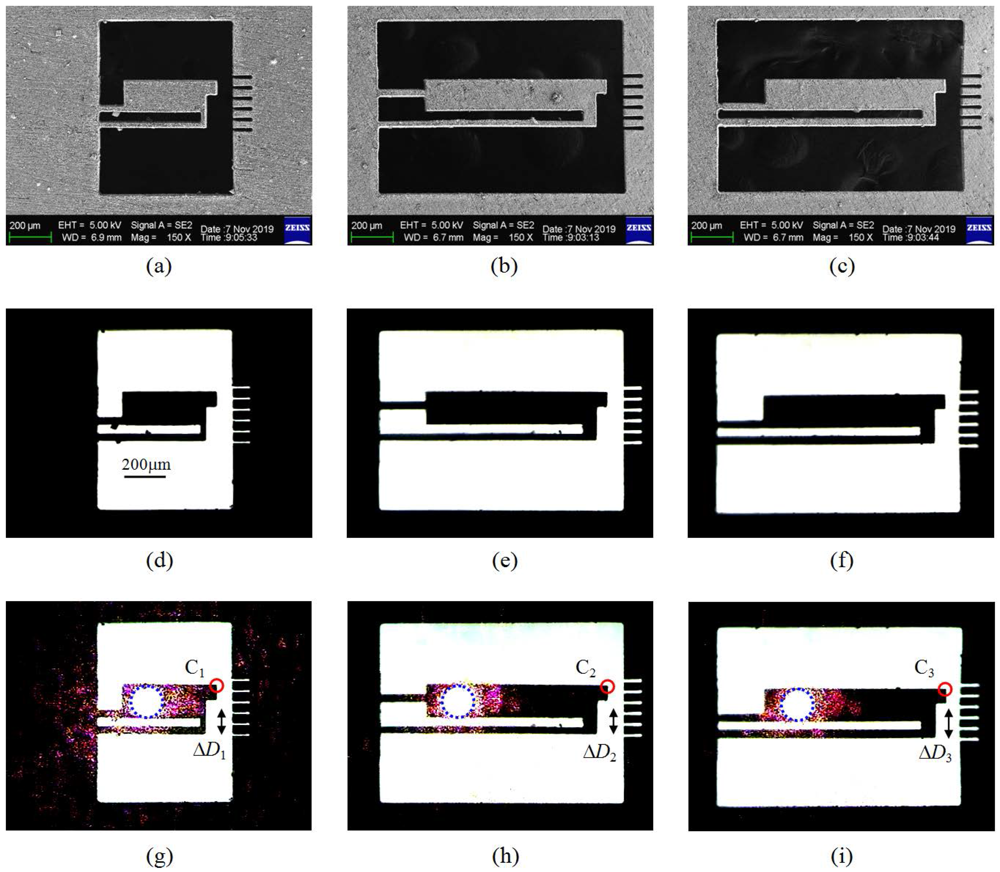

+++
# Date this page was created.
date = 2015-12-31T00:00:00

# Project title.
title = "Optothermal Microactuator"
# Project summary to display on homepage.
summary = " "

 weight = 1

# Tags: can be used for filtering projects.
# Example: `tags = ["machine-learning", "deep-learning"]`
tags = []

# Optional external URL for project (replaces project detail page).
external_link = ""

# Slides (optional).
#   Associate this project with Markdown slides.
#   Simply enter your slide deck's filename without extension.
#   E.g. `slides = "example-slides"` references 
#   `content/slides/example-slides.md`.
#   Otherwise, set `slides = ""`.
# slides = "example-slides"

# Links (optional).
url_pdf = ""
url_slides = ""
url_video = ""
url_code = ""

# Custom links (optional).
#   Uncomment line below to enable. For multiple links, use the form `[{...}, {...}, {...}]`.
url_custom = []

# Does the project detail page use math formatting?
math = true

# Featured image
# To use, add an image named `featured.jpg/png` to your page's folder. 
[image]
  # Caption (optional)
  caption = ""

  # Focal point (optional)
  # Options: Smart, Center, TopLeft, Top, TopRight, Left, Right, BottomLeft, Bottom, BottomRight
  focal_point = "Smart"
  
  # Show image only in page previews?
  preview_only = true

+++
## Summary

  This work which belongs to National High-tech R&D Program (863 Program) presents microscopic research on properties of asymmetric optothermal microactuator (OTMA) with different lever ratios. Under laser beam irradiation, the temperature of each expansion arm increases since part of laser power is absorbed, causing longitudinal thermal expansion to the expansion arms and lateral deflection to the OTMAs. To obtain optimized deflecting properties, three OTMAs with different total lengths/lever ratios of 540 µm/7.2, 1080 µm/7.2, 1080 µm/14.4 are further microfabricated and experimented using an optical microscopic observing and measuring system combined with a charge-coupled device (CCD). The experimental results show that these OTMAs can be directly actuated by laser beam and acquire maximum deflections of 6.8 µm, 7.2 µm and 11.4 µm when only 2.8 mW laser power is employed. In addition, it is demonstrated that the deflection amplitude can significantly increase as the lever ratio getting larger. With their characteristic elegances, the OTMAs are expected to be practically applied in MEMS/MOEMS.

## Related publications
* Microscopic research on the properties of optothermal microactuators with different lever ratios
* Laser-Driven Optothermal Microactuator Operated in the Water
