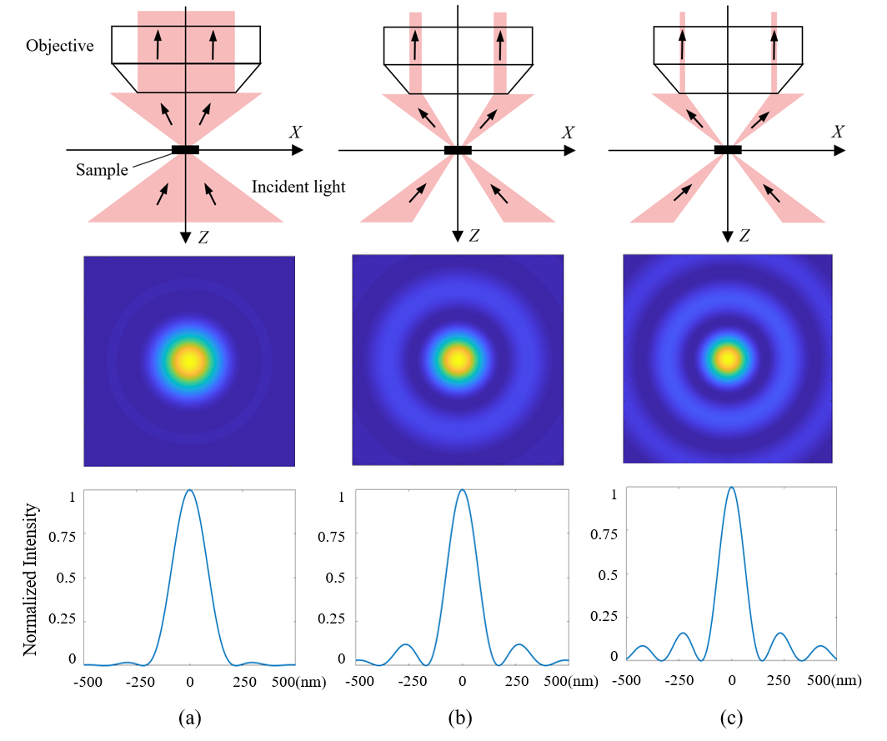

+++
# Date this page was created.
date = 2015-12-31T00:00:00

# Project title.
title = "Annular Light-cone Illumination Imaging"
# Project summary to display on homepage.
summary = " "

 weight = 3

# Tags: can be used for filtering projects.
# Example: `tags = ["machine-learning", "deep-learning"]`
tags = []

# Optional external URL for project (replaces project detail page).
external_link = ""

# Slides (optional).
#   Associate this project with Markdown slides.
#   Simply enter your slide deck's filename without extension.
#   E.g. `slides = "example-slides"` references 
#   `content/slides/example-slides.md`.
#   Otherwise, set `slides = ""`.
# slides = "example-slides"

# Links (optional).
url_pdf = ""
url_slides = ""
url_video = ""
url_code = ""

# Custom links (optional).
#   Uncomment line below to enable. For multiple links, use the form `[{...}, {...}, {...}]`.
url_custom = [{icon_pack = "fab", icon="twitter", name="Follow", url = "https://twitter.com/janani137"}]

# Does the project detail page use math formatting?
math = true

# Featured image
# To use, add an image named `featured.jpg/png` to your page's folder. 
[image]
  # Caption (optional)
  caption = ""

  # Focal point (optional)
  # Options: Smart, Center, TopLeft, Top, TopRight, Left, Right, BottomLeft, Bottom, BottomRight
  focal_point = "Smart"
  
  # Show image only in page previews?
  preview_only = true

+++
## Summary

  A new far-field super-resolution method for optical microscopic imaging is proposed based on narrow-band filtered annular light-cone illumination with high numerical aperture. In this method, only a part of transmitted light (εN.A.-N.A., ε is the ratio of inner diameter to outer diameter of this annular light-cone’ cross section) can participate in imaging through objectives. MATLAB simulations have been carried out when ε is 0, 0.6, and 0.9 respectively (as shown in the above figure, ε = 450 nm, N.A. = 1.25) based on the scalar diffraction theory. According to the results, the intensity with full width at half maxima (FWHM) significantly decreases with the increase in ε. As a result, the diffraction limit has been broken. Further experiments are under performing.

